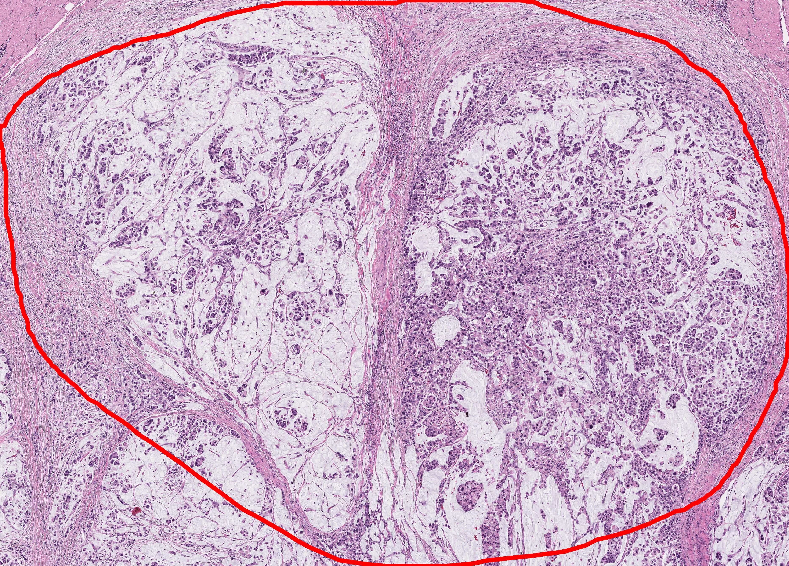
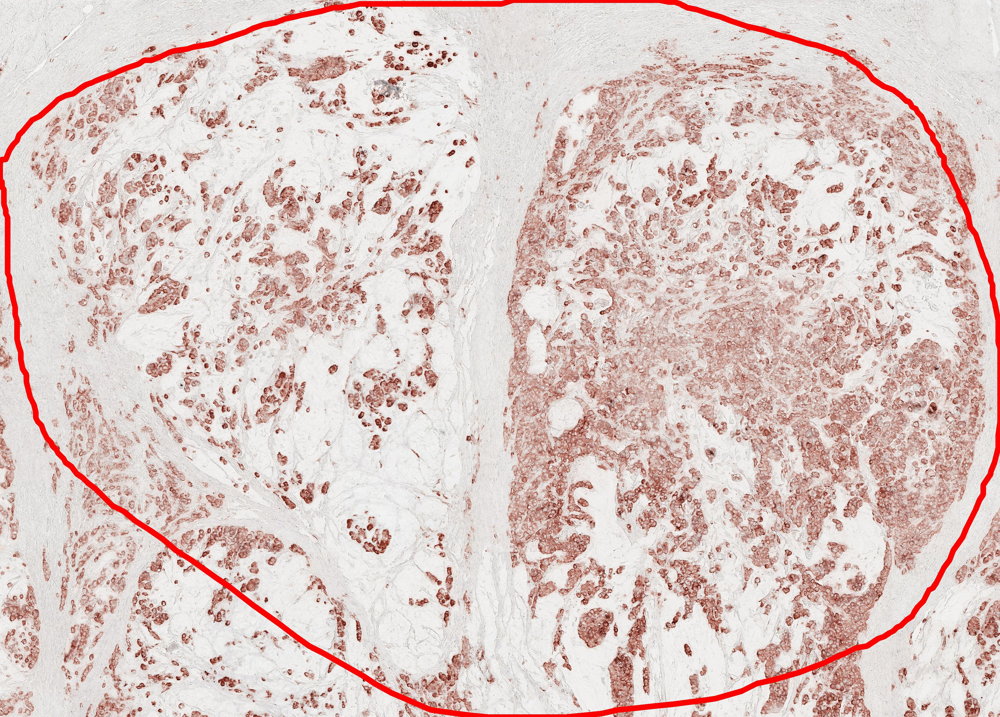

# Introduction
### virtual staining 
This repository is for virtual staining (transforming H&E image into CK (cytokeratin) image).
# Requirement
+ python >= 3.6
  + numpy >=1.17.4
  + matplotlib >=3.1.1
  + opencv-python >= 4.1.2.30
  + openslide-python >= 1.1.2
  + pandas >= 1.1.3
  + scikit-image >= 0.15.0
  + scikit-learn >= 0.23.2
  + tifffile >= 2020.7.4
  + torch >= 1.5.1 (https://pytorch.org/)
  + torchvision >= 0.6.1
  + tqdm >= 4.50.2 
+ openslide >= 3.4.1 (https://openslide.org/)
# Usage
- -input_path: path for input H&E image (.svs). example images in ```data/input```
- -output_dir: directory for output CK image
- -model_checkpoint: path for model weight (https://drive.google.com/file/d/1-1TqdXRCApmqjSXXiDNwsMbo4Uz8EITJ/view?usp=sharing) 
```
python -input_path data/input/example.svs -output_dir data/output -model_checkpoint data/checkpoint/model.pth
```
# Example Image
| Input | Output_CK | Output_Segment |
|---|---|---|
||||

# Reference
Hong, Y., Heo, Y.J., Kim, B. et al. Deep learning-based virtual cytokeratin staining of gastric carcinomas to measure tumor–stroma ratio. Sci Rep 11, 19255 (2021). https://doi.org/10.1038/s41598-021-98857-1

